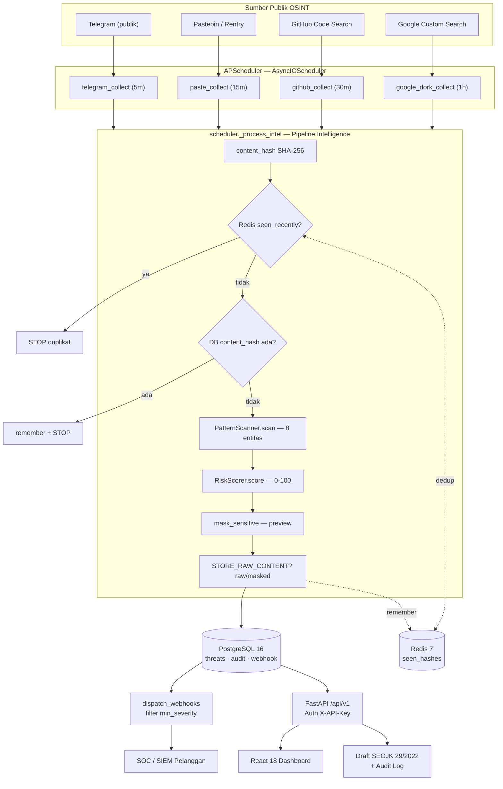

# Arsitektur Sistem SHARK-Fin

**Source Hunting Alert and Risk Knowledge for Financial Intelligence**

Dokumen ini menguraikan arsitektur teknis SHARK-Fin sebagaimana benar-benar terimplementasi di dalam repositori (`github.com/0xNoramiya/shark-fin`) untuk pengajuan PIDI Tahap 2. Seluruh deskripsi di sini di-*grounding* langsung pada kode sumber; setiap angka kapasitas yang belum diukur ditandai sebagai **estimasi**. Tujuannya adalah memberi penilai gambaran arsitektur yang jujur, dapat diaudit, dan tidak melebih-lebihkan kemampuan prototipe.

---

## 1. Ringkasan Arsitektur

SHARK-Fin adalah aplikasi *monorepo* dengan empat layanan yang diorkestrasi melalui **Docker Compose**. Sistem mengadopsi pola tiga lapis fungsional — **Collection → Intelligence → Action** — di atas tumpukan teknologi berikut.

| Lapisan | Komponen | Teknologi | Peran |
|---|---|---|---|
| Collection | 4 collector OSINT | Python 3.11, Telethon, httpx | Mengumpulkan konten dari sumber publik secara berkala |
| Intelligence | Classifier + Risk Scorer + Dedup | Regex + validasi algoritmik (tanpa ML) | Mendeteksi, memvalidasi, dan menilai entitas data finansial |
| Action | API + Dashboard + Webhook + Audit | FastAPI, React 18, APScheduler | Menyajikan feed, mengirim alert, dan mendukung kepatuhan |
| Persistensi | Basis data otoritatif | PostgreSQL 16 (UUID PK, JSONB, ARRAY) | Sumber kebenaran untuk threat dan dedup |
| Akselerator | Cache jalur-panas (opsional) | Redis 7 | Mempercepat dedup; *graceful degradation* bila tidak tersedia |

**Prinsip desain inti:**

1. **PostgreSQL otoritatif, Redis opsional.** Dedup dijamin oleh *unique constraint* pada kolom `content_hash` di Postgres. Redis hanya mempercepat jalur-panas dan akan ber-*degrade* menjadi *no-op* bila tidak terjangkau — sistem tetap berjalan.
2. **Privacy-by-design (UU PDP No. 27/2022).** Konten mentah tidak pernah diekspos melalui API; *masking* dua-lapis dan mode penyimpanan hanya-hash diterapkan.
3. **Deteksi deterministik & dapat dijelaskan.** Classifier murni regex + validasi algoritmik (Luhn, checksum NPWP, validasi NIK, tabel BIN). Tidak ada model ML — setiap temuan dapat dijelaskan dan diaudit.

---

## 2. Diagram Arsitektur

### 2.1 Diagram ASCII — Tampilan Komponen & Aliran Data

```
                         SUMBER PUBLIK (OSINT)
   ┌──────────────┬──────────────┬──────────────┬──────────────────┐
   │  Telegram    │  Pastebin /  │   GitHub     │   Google Custom  │
   │  (publik)    │  Rentry      │  Code Search │   Search (Dork)  │
   └──────┬───────┴──────┬───────┴──────┬───────┴────────┬─────────┘
          │              │              │                │
   ┌──────▼──────────────▼──────────────▼────────────────▼─────────┐
   │  LAPISAN COLLECTION — APScheduler (AsyncIOScheduler)           │
   │  4 job interval: telegram 5m · paste 15m · github 30m         │
   │                  · google_dork 1h         → menghasilkan RawIntel
   └───────────────────────────────┬───────────────────────────────┘
                                    │  _process_intel(...)
   ┌────────────────────────────────▼──────────────────────────────┐
   │  LAPISAN INTELLIGENCE (pipeline scheduler._process_intel)      │
   │                                                                │
   │   content_hash (SHA-256)                                       │
   │        │                                                       │
   │        ├──► [1] Redis seen_recently?  ──ya──► STOP (duplikat)  │
   │        │         (jalur cepat, opsional)                       │
   │        ├──► [2] DB: SELECT content_hash ─ada─► remember + STOP │
   │        │         (otoritatif)                                  │
   │        ├──► [3] PatternScanner.scan()  → 8 tipe entitas        │
   │        │         (regex + Luhn/NIK/NPWP/BIN)                   │
   │        ├──► [4] RiskScorer.score()     → skor 0-100 + severity │
   │        ├──► [5] mask_sensitive()       → content_preview       │
   │        └──► [6] STORE_RAW_CONTENT? → stored_raw (raw / masked) │
   └───────────────────────────────┬───────────────────────────────┘
                                    │  persist Threat row + cache.remember()
   ┌────────────────────────────────▼──────────────────────────────┐
   │  PERSISTENSI                                                   │
   │  ┌──────────────────────────┐      ┌────────────────────────┐ │
   │  │  PostgreSQL 16           │      │  Redis 7 (opsional)    │ │
   │  │  threats (UUID, JSONB,   │◄────►│  set sharkfin:         │ │
   │  │  ARRAY, content_hash UQ) │ ded. │  seen_hashes (TTL 7h)  │ │
   │  │  webhook_subscriptions   │      └────────────────────────┘ │
   │  │  audit_logs · sources    │                                 │
   │  └──────────────────────────┘                                 │
   └───────────────┬─────────────────────────────┬─────────────────┘
                   │ dispatch_webhooks()          │
   ┌───────────────▼──────────┐      ┌────────────▼────────────────┐
   │  WEBHOOK DISPATCH        │      │  LAPISAN ACTION — FastAPI    │
   │  filter min_severity     │      │  /api/v1 (threats, reports,  │
   │  header X-SHARK-Fin-Key  │      │  alerts, stats, audit)       │
   │  payload masked-only     │      │  Auth: X-API-Key             │
   │  httpx timeout 10s       │      │  /health (db + redis)        │
   └───────────────┬──────────┘      └────────────┬─────────────────┘
                   │                               │
        ┌──────────▼─────────┐         ┌───────────▼───────────────┐
        │  SOC / SIEM        │         │  React 18 Dashboard        │
        │  lembaga pelanggan │         │  (Vite/Tailwind/Recharts)  │
        └────────────────────┘         └────────────────────────────┘
```

### 2.2 Diagram Mermaid — Aliran End-to-End



---

## 3. Komponen Sistem (Riil)

### 3.1 Lapisan Collection — Empat Collector OSINT

Seluruh collector mewarisi kelas abstrak `BaseCollector` (`collectors/base.py`) dan menghasilkan objek `RawIntel` (`source_url`, `content`, `source_type`, `posted_at`, `metadata`) melalui *async generator* `collect()`. Orkestrasi dilakukan oleh **APScheduler** (`AsyncIOScheduler`) dengan empat *interval job*.

| Collector | Sumber | Teknologi | Interval | Kredensial yang dibutuhkan |
|---|---|---|---|---|
| `TelegramCollector` | Kanal publik Telegram | Telethon | 5 menit | `TELEGRAM_API_ID`, `TELEGRAM_API_HASH`, `TELEGRAM_CHANNELS` |
| `PasteSiteCollector` | Pastebin / Rentry | httpx | 15 menit | — (publik) |
| `GitHubCollector` | GitHub Code Search | httpx | `GITHUB_POLL_INTERVAL` (default 1800 s / 30 m) | `GITHUB_TOKEN` |
| `GoogleDorkCollector` | Google Custom Search | httpx | `GOOGLE_DORK_INTERVAL` (default 3600 s / 1 j) | `GOOGLE_CSE_API_KEY`, `GOOGLE_CSE_ID` |

**Catatan kejujuran implementasi.** Collector melakukan panggilan API eksternal nyata, namun memerlukan kredensial yang kosong di `.env.example`. Dengan konfigurasi default, *scheduler* tetap berjalan tetapi collector akan *early-return* (mis. `GitHubCollector` mengembalikan hasil kosong bila `GITHUB_TOKEN` tidak ada) sehingga tidak menghasilkan data. Data yang ditampilkan pada demo berasal dari *seed* demo (`scripts/seed_demo.py`, 20 threat), konsisten dengan posisi "prototipe fungsional + demo langsung".

### 3.2 Lapisan Intelligence

#### 3.2.1 Classifier — Regex + Validasi Algoritmik (Tanpa ML)

Berkas `classifier/patterns.py` mengimplementasikan `PatternScanner.scan()` yang mendeteksi **8 tipe entitas** data finansial Indonesia. Deteksi bersifat **deterministik dan dapat dijelaskan** — bukan NLP/ML — yang menjadi keunggulan untuk konteks audit dan regulasi.

| Tipe entitas | Mekanisme validasi | Confidence (contoh) |
|---|---|---|
| `CREDIT_CARD` | Algoritma **Luhn** + lookup tabel `INDONESIAN_BINS` (10 bank) | 0,95 (BIN dikenal) / 0,70 |
| `NIK` | Validasi tanggal lahir (DDMMYY, +40 untuk perempuan) + kode provinsi 1–92 | 0,90 (ada konteks) / 0,70 |
| `NPWP` | Checksum *weighted-sum* mod-10 (15 digit) + konteks | 0,90 / 0,80 / 0,60 |
| `ACCOUNT_NUMBER` | Konteks kata kunci rekening + prefiks bank lokal | 0,80 / 0,60 |
| `CREDENTIAL` | Pasangan user/email + password berdekatan | 0,85 |
| `CVV` | Pola kode 3–4 digit dekat konteks kartu | 0,75 |
| `BANK_NAME` | Lookup daftar 30+ nama bank/e-wallet Indonesia | 1,0 |
| `BANKING_KEYWORD` | Lookup kata kunci perbankan Bahasa Indonesia | 1,0 |

Tabel **`INDONESIAN_BINS`** memuat prefiks BIN untuk 10 bank nasional: BRI, BNI, Mandiri, BCA, BSI, CIMB, Permata, Danamon, Mega, dan BTN. Setiap entitas mengembalikan `confidence` dalam rentang 0–1 beserta metadata (mis. jaringan kartu, kode provinsi NIK, validitas checksum NPWP).

#### 3.2.2 Risk Scorer — Skor Komposit 0–100

Berkas `classifier/scorer.py` menghitung skor risiko komposit:

```
skor = clamp( Σ(base_weight_i × confidence_i)
              × volume_multiplier
              × freshness_multiplier
              × source_credibility , 0, 100 )
```

| Faktor | Detail |
|---|---|
| `BASE_WEIGHTS` | CREDIT_CARD 40, CREDENTIAL 35, ACCOUNT_NUMBER 30, NIK 25, NPWP 20, CVV 15, BANK_NAME 3, BANKING_KEYWORD 2 |
| `volume_multiplier` | ×2,0 (≥1000 rekaman) · ×1,5 (≥100) · ×1,0 (selain itu) |
| `freshness_multiplier` | ×1,3 (<1 jam) · ×1,1 (<24 jam) · ×1,0 (selain itu) |
| `SOURCE_CREDIBILITY` | carding_forum 1,4 · telegram 1,2 · hibp 1,1 · paste 1,0 · google_dork 0,9 · github 0,8 |

Pemetaan severity: **CRITICAL** (≥86), **HIGH** (≥61), **MEDIUM** (≥31), **LOW** (<31). Daftar `factors` disertakan pada setiap hasil untuk transparansi penilaian.

#### 3.2.3 Dedup SHA-256

`classifier/dedup.py` menghitung `content_hash` sebagai digest SHA-256 dari teks UTF-8. Hash ini menjadi kunci dedup dua-tingkat: jalur cepat Redis, lalu *unique constraint* otoritatif pada kolom `content_hash` di PostgreSQL.

### 3.3 Masking & Mode STORE_RAW_CONTENT

Perlindungan data diterapkan dalam **dua lapis nyata** (`models/threat.py` dan `config.py`):

1. **`mask_sensitive()`** — regex menyamarkan kartu kredit (sisakan 4+4), NIK (sisakan 6+2), serta nilai `password/pin/secret` menjadi `[TERSEMBUNYI]`, lalu memotong teks menjadi 200 karakter. Hasilnya menjadi `content_preview`.
2. **Flag `STORE_RAW_CONTENT`** (default `False`). Pada mode hanya-hash, `scheduler._process_intel` menyetel `stored_raw = preview` (teks tersamar) sehingga kolom `Threat.raw_content` tidak pernah menerima teks asli; teks penuh hanya dipakai di memori untuk klasifikasi dan dedup.

> **Catatan kolom.** `raw_content` bersifat `nullable=False`, sehingga selalu berisi minimal *preview* tersamar (tidak pernah `NULL`, dan dalam mode hanya-hash tidak pernah berisi teks asli).

### 3.4 Persistensi — PostgreSQL 16 (JSONB & ARRAY)

PostgreSQL 16 adalah **sumber kebenaran**. Tabel dibuat melalui `Base.metadata.create_all` di `init_db` (lihat keterbatasan pada Bagian 6).

| Tabel | Kolom kunci | Tipe khas |
|---|---|---|
| `threats` | `id` (UUID PK), `detected_entities` (JSONB), `institution_tags` (ARRAY), `content_hash` (UNIQUE, index), `risk_score`, `severity`, `status` | UUID · JSONB · ARRAY |
| `webhook_subscriptions` | `url`, `institution`, `min_severity`, `api_key`, `active` | — |
| `audit_logs` | `action` (index), `actor` (fingerprint), `target_id`, `detail` (JSONB), `created_at` (index) | JSONB |
| `sources` | `source_type`, `name`, `url`, `enabled` | — |
| `alerts` | `threat_id` (FK), `channel`, `destination`, `payload` (JSONB) | JSONB |

Akses basis data menggunakan **SQLAlchemy 2.0 async** dengan driver **asyncpg**.

### 3.5 Redis 7 — Akselerator Dedup & Health

Berkas `cache.py` menggunakan Redis sebagai akselerator opsional, **bukan** sumber kebenaran:

- `seen_recently(hash)` / `remember(hash)` beroperasi pada *set* bersama `sharkfin:seen_hashes` dengan TTL **7 hari**.
- Pipeline memeriksa Redis sebagai *fast-path* sebelum melakukan kueri dedup ke DB, dan memanggil `remember()` setelah persist.
- `/health` memanggil `cache.ping()` dan melaporkan status Redis.
- Bila Redis tidak tersedia, seluruh operasi *degrade* menjadi *no-op* (klien lazy dengan `socket_connect_timeout=2`) sehingga pipeline tetap jalan.

Berbagi *set* hash antar-*worker* inilah yang **secara arsitektural** memungkinkan penskalaan horizontal pengumpulan (lihat Bagian 7).

### 3.6 Lapisan Action — FastAPI

Backend adalah aplikasi **FastAPI** (`app.main`) dengan *lifespan hook* yang menjalankan `init_db()` lalu `start_scheduler()`. Tersedia **10 rute** (diverifikasi melalui OpenAPI langsung).

| Endpoint | Metode | Auth | Fungsi |
|---|---|---|---|
| `/api/v1/threats` | GET | Publik | Feed berpaginasi; filter severity, source_type, status, tanggal, institution, limit (1–200), offset |
| `/api/v1/threats/{id}` | GET | Publik | Detail satu threat |
| `/api/v1/threats/{id}/status` | PATCH | **X-API-Key** | Alur status analis; menulis audit `threat.status_update` (from/to/note) |
| `/api/v1/threats/{id}/report?format=ojk\|intel` | GET | **X-API-Key** | Draft SEOJK (ojk) atau laporan intel internal (teks); menulis audit `report.export` |
| `/api/v1/stats/summary` | GET | Publik | Total by_severity/source/status, institutions_mentioned, total_records_exposed_estimate |
| `/api/v1/alerts/webhook/register` | POST | **X-API-Key** | Mendaftarkan subscriber (url, institution, min_severity, api_key) |
| `/api/v1/alerts/webhook/subscriptions` | GET | **X-API-Key** | Daftar langganan aktif (api_key tidak dikembalikan dalam respons) |
| `/api/v1/alerts/webhook/{id}` | DELETE | **X-API-Key** | *Soft-delete* (active=False) |
| `/api/v1/audit` | GET | **X-API-Key** | Entri audit terbaru; filter action opsional; limit (1–500) |
| `/health` | GET | Publik | Status + `dependencies.database` + `dependencies.redis` |

Respons `/health` langsung mengembalikan `{"status":"ok","dependencies":{"database":"ok","redis":"ok"}}`.

#### 3.6.1 Pembangkitan Laporan SEOJK 29/2022 & Intel

Endpoint `report` (`api/reports.py`) menghasilkan `PlainTextResponse`: draft notifikasi **SEOJK 29/SEOJK.03/2022** (`format=ojk`, mendukung kewajiban notifikasi awal 24 jam) atau laporan intel internal (`format=intel`), keduanya berbahasa Indonesia dengan tabel entitas dan rekomendasi. Aksi ekspor diaudit sebagai `report.export`.

### 3.7 Webhook Dispatch

Layanan `services/webhook.py` (`dispatch_webhooks`) dipanggil dari `scheduler._process_intel` setelah setiap threat dipersist, dibungkus `try/except` agar kegagalan webhook tidak pernah memutus pipeline pengumpulan.

- Memfilter subscriber berdasarkan `min_severity` per-subscriber (`_SEVERITY_ORDER`).
- Mengirim header `X-SHARK-Fin-Key`.
- Payload **hanya tersamar** (`content_preview` + `entity_counts`, tanpa konten mentah).
- `httpx.AsyncClient` dengan `timeout=10.0`.

Diverifikasi oleh `tests/test_webhook.py` (filter severity, lewati subscriber non-aktif, 0 subscriber = 0 dispatch).

### 3.8 Audit Log

`models/audit.py` mendefinisikan `AuditLog` (`action`, `actor`, `target_id`, `detail` JSONB, `created_at`, ber-index) dan fungsi `fingerprint()`. `services/audit.record_audit` melakukan penulisan *best-effort* dengan *commit* sendiri. Aksi yang **terekam saat runtime**: `threat.status_update` (`api/threats.py`), `report.export` (`api/reports.py`), serta `webhook.register` dan `webhook.delete` (`api/alerts.py`).

Actor disimpan sebagai **fingerprint SHA-256 non-reversibel** (`"key:" + sha256(key)[:12]`, atau `"anonymous"`) — kunci asli tidak pernah disimpan. Diverifikasi non-reversibel oleh `tests/test_audit.py`.

> **Catatan transparansi.** Seluruh aksi tulis (perubahan status, ekspor laporan, registrasi/penghapusan webhook) kini memanggil `record_audit` saat runtime dan tertelusur — diverifikasi live. Keterbatasan tersisa: `api_key` pelanggan webhook masih disimpan plaintext di DB (roadmap: enkripsi).

### 3.9 APScheduler

`AsyncIOScheduler` mendaftarkan empat *interval job* (Bagian 3.1) dan memulai eksekusi pada *startup* aplikasi. Setiap job memanggil collector dan mengalirkan setiap `RawIntel` ke `_process_intel`. Setiap collector dibungkus `try/except` sehingga kegagalan satu collector tidak menghentikan yang lain.

### 3.10 Dashboard React

Frontend adalah **React 18 + Vite 6 + Tailwind 3 + Recharts + react-query + react-router + axios**:

- Halaman/komponen: `App.jsx`, `pages/`, `components/` (`ThreatFeed.jsx`, `ThreatDetail.jsx`, `StatCards.jsx`, `SourceChart.jsx`, `ThemeToggle.jsx`).
- Hooks: `useThreats`, `useStats`, `useTheme`.
- `api/client.js`: axios dengan header `X-API-Key`, `baseURL = VITE_API_URL || /api/v1`.
- Deploy: **Vercel** (`vercel.json`, build `frontend/dist`, *SPA rewrites*) dan **GitHub Pages** (`VITE_BASE_URL=/shark-fin/`, fallback `404.html`).

---

## 4. Pipeline Data End-to-End

Berikut alur penuh satu butir intel, sesuai `scheduler._process_intel`:

1. **Pengumpulan.** Job APScheduler memanggil `collector.collect()` yang menghasilkan `RawIntel` (konten + metadata + `posted_at`).
2. **Hashing.** `content_hash(content)` menghasilkan digest SHA-256.
3. **Dedup jalur-cepat (Redis).** Bila `cache.seen_recently(h)` `True` → proses dihentikan (duplikat).
4. **Dedup otoritatif (Postgres).** `SELECT Threat.id WHERE content_hash = h`. Bila ada → `cache.remember(h)` dan berhenti.
5. **Klasifikasi.** `PatternScanner.scan(content)` menghasilkan daftar entitas. Bila kosong → berhenti.
6. **Penilaian.** `RiskScorer.score(...)` menghasilkan skor 0–100 + severity + faktor.
7. **Tagging institusi.** `institution_tags` diambil dari entitas `BANK_NAME` terdeteksi.
8. **Masking.** `mask_sensitive(content)` → `content_preview`.
9. **Mode penyimpanan.** `stored_raw = content if STORE_RAW_CONTENT else preview`.
10. **Persist.** Baris `Threat` (UUID, JSONB `detected_entities`, ARRAY `institution_tags`, `content_hash`, `risk_score`, `severity`) di-*commit* ke Postgres, lalu `cache.remember(h)`.
11. **Dispatch webhook.** `dispatch_webhooks(...)` mengirim alert tersamar ke subscriber yang lolos filter `min_severity` (dibungkus `try/except`).
12. **Konsumsi.** Analis melihat feed di dashboard (atau via API publik), mengubah status `NEW → VERIFIED → MITIGATED/FALSE_POSITIVE` (teraudit), dan mengekspor draft SEOJK/intel (teraudit).

---

## 5. Postur Keamanan & Kepatuhan

### 5.1 Kepatuhan UU PDP No. 27/2022 (Minimisasi Data)

| Kontrol | Implementasi (diverifikasi) |
|---|---|
| Minimisasi data | Konten mentah tidak pernah diekspos via API. Skema `ThreatResponse` (`api/threats.py`) **tidak** memuat `raw_content` — hanya `content_preview`, `detected_entities` (nilai sudah tersamar, mis. `405290******0000`, `***`, `user=x pass=***`), dan `content_hash`. *Grep* memastikan tidak ada *serializer* API yang merujuk `raw_content`. |
| Mode hanya-hash | `STORE_RAW_CONTENT=False` (default) → kolom `raw_content` hanya menyimpan *preview* tersamar; teks asli tidak pernah dipersist. |
| Masking dua-lapis | `mask_sensitive()` (kartu 4+4, NIK 6+2, password/pin/secret → `[TERSEMBUNYI]`, potong 200 char). |
| Pseudonimisasi actor | Actor audit = fingerprint SHA-256 non-reversibel; kunci asli tidak disimpan. |

> Selaras dengan **Pasal 16 UU PDP** (minimisasi data) dan mendukung pengendali data dalam kewajiban deteksi/notifikasi dini.

### 5.2 Kontrol Akses — X-API-Key

Autentikasi menggunakan `APIKeyHeader` (`middleware/auth.py`, `require_api_key`) dengan daftar kunci `API_KEYS` (dipisah koma). **Endpoint tulis/ekspor/audit memerlukan auth**; endpoint baca (`/threats`, `/threats/{id}`, `/stats/summary`) bersifat publik. Diverifikasi oleh `test_api` (`test_update_unauthorized` → 401) dan `test_audit` (`test_audit_requires_api_key` → 401).

### 5.3 Audit Log & Keterlacakan

Setiap aksi terproteksi yang berjalan (`threat.status_update`, `report.export`) terekam dalam `audit_logs` dengan actor ter-*fingerprint*, `target_id`, dan `detail` JSONB — mendukung keterlacakan yang diharapkan **SEOJK 29/2022** dan **POJK 11/2022** atas penanganan insiden.

### 5.4 Keterbatasan Keamanan yang Diakui (Estimasi & Roadmap)

Demi kejujuran teknis, keterbatasan berikut diakui terbuka dan diposisikan sebagai *roadmap produksi*, bukan klaim:

- **Auth statis tanpa rotasi/scope.** `API_KEYS` dibandingkan secara plaintext (default `sharkfin-demo-key-2026`); tidak ada *rate limiting*, rotasi kunci, atau otorisasi per-scope. Memadai untuk prototipe, bukan manajemen rahasia produksi.
- **Kunci subscriber webhook disimpan plaintext.** Kolom `webhook_subscriptions.api_key` menyimpan kunci subscriber dalam bentuk teks. (Respons `GET /subscriptions` sudah benar menghilangkan field ini, namun penyimpanannya tetap plaintext.) *Fingerprinting* hanya melindungi kunci platform sendiri.
- **Tanpa enkripsi at-rest & RBAC.** Belum ada enkripsi data at-rest maupun *role-based access control* — keduanya masuk roadmap, sejalan dengan kerangka CIRT Peraturan BSSN No. 1/2024.
- **Sumber hanya publik/legal.** SHARK-Fin memantau OSINT sumber publik (Telegram publik, Pastebin/Rentry, GitHub, Google Dork), bukan akses ilegal *dark web* — sekaligus menghindari menjadi penampung data bocor melalui minimisasi data.

---

## 6. Pengujian, CI, & Keterbatasan Infrastruktur

### 6.1 Status Pengujian (Diverifikasi)

`pytest -q` dijalankan di dalam kontainer `shark-fin-backend` terhadap layanan PostgreSQL 16 nyata menghasilkan **`102 passed`**.

| Berkas | Jumlah tes | Cakupan |
|---|---|---|
| `test_patterns.py` | 63 | Classifier (Luhn, NIK, NPWP, BIN) |
| `test_scorer.py` | 16 | Risk scorer & severity |
| `test_api.py` | 14 | Endpoint API & auth |
| `test_webhook.py` | 5 | Dispatch & filter severity |
| `test_audit.py` | 4 | Audit log & fingerprint |
| **Total** | **102** | — |

Tes memakai PostgreSQL nyata (`conftest` `TEST_DATABASE_URL`) dan klien httpx `ASGITransport` dengan *override* `get_session`; dispatch webhook di-*mock* sehingga tidak ada panggilan jaringan nyata.

### 6.2 CI/CD

`.github/workflows/backend-tests.yml` menjalankan `pytest -v` terhadap layanan `postgres:16-alpine` pada *push/PR* yang menyentuh `backend/**` serta `workflow_dispatch` (Python 3.11, cache pip). Frontend di-*deploy* via Vercel dan GitHub Pages.

### 6.3 Keterbatasan Infrastruktur (Diakui)

- **Tanpa migrasi Alembic.** `init_db` memakai `Base.metadata.create_all` meski `alembic` ada di dependensi. Memadai untuk prototipe; ditandai sebagai item produksi.
- **Single-worker dev.** Dockerfile menjalankan `uvicorn --reload` (mode dev, satu proses). Akibatnya manfaat penskalaan horizontal melalui Redis bersifat **arsitektural/laten**, belum diuji pada *deployment* satu-*worker* saat ini.
- **`total_records_exposed_estimate`** pada `/stats/summary` adalah heuristik sederhana (`total × 5`), **bukan** turunan dari jumlah entitas terdeteksi — ditandai sebagai *estimasi*.

---

## 7. Skalabilitas Horizontal

### 7.1 Fondasi Teknis (Telah Ada)

| Mekanisme | Dukungan skalabilitas |
|---|---|
| Dedup bersama via Redis | *Set* `sharkfin:seen_hashes` dibagi antar-*worker*; beberapa *worker* collector dapat berbagi status hash-terlihat alih-alih masing-masing membebani DB. |
| PostgreSQL otoritatif | *Unique constraint* `content_hash` menjamin idempotensi dedup walau banyak *worker* menulis paralel. |
| Collector modular | Penambahan sumber baru tidak mengubah pipeline `_process_intel` — cukup menambah collector + job APScheduler. |
| Pipeline async | FastAPI + SQLAlchemy async + asyncpg + APScheduler mendukung I/O non-blok. |
| Biaya marginal rendah | Deteksi deterministik (regex/checksum) tanpa GPU/ML → biaya komputasi per item rendah (estimasi). |

### 7.2 Posisi Jujur & Roadmap Penskalaan

Manfaat penskalaan horizontal saat ini bersifat **arsitektural/laten**: arsitektur cache-bersama mendukungnya, tetapi *deployment* berjalan sebagai satu *worker* `uvicorn --reload` (dev), sehingga manfaat tersebut **belum benar-benar dijalankan**. Roadmap penskalaan yang diakui:

1. Multi-*worker* uvicorn/gunicorn produksi (memanfaatkan dedup-bersama Redis).
2. Migrasi skema terkelola dengan **Alembic** (menggantikan `create_all`).
3. *Sharding* sumber collector dan penambahan tipe entitas/sumber.
4. Arsitektur multi-tenant untuk skenario regulator (estimasi, di luar MVP saat ini).

### 7.3 Skalabilitas Bisnis (Network Effect)

Secara non-teknis, model **intelijen-bersama lintas-lembaga** (analog FS-ISAC) menciptakan *network effect*: setiap lembaga baru yang terhubung menambah nilai *feed* bagi seluruh ekosistem. Strategi *land-and-expand* dari segmen BPR/fintech kecil menuju anchor regulator memperbesar cakupan tanpa menaikkan biaya marginal secara signifikan.

---

## 8. Topologi Deployment

```
Docker Compose (4 layanan)
┌───────────────┐   ┌───────────────┐   ┌──────────────────┐   ┌──────────────┐
│  postgres:16  │   │  redis:7      │   │  backend         │   │  frontend    │
│  -alpine      │◄──┤  -alpine      │◄──┤  FastAPI/uvicorn │◄──┤  React/Vite  │
│  port 5433→   │   │  port 6379    │   │  port 8001→8000  │   │  port 5173   │
│  5432         │   │  healthcheck  │   │  --reload (dev)  │   │              │
│  healthcheck  │   │               │   │  depends_on:     │   │  depends_on: │
│  (pg_isready) │   │  (redis-cli)  │   │  pg+redis healthy│   │  backend     │
└───────────────┘   └───────────────┘   └──────────────────┘   └──────────────┘

Produksi frontend: Vercel (vercel.json, SPA rewrites) + GitHub Pages (VITE_BASE_URL=/shark-fin/)
```

---

## 9. Ringkasan

SHARK-Fin adalah **prototipe fungsional** dengan arsitektur tiga-lapis yang koheren: 4 collector OSINT diorkestrasi APScheduler, classifier deterministik berbasis regex + validasi algoritmik (Luhn, checksum NPWP, validasi NIK, 10 tabel BIN), risk scorer komposit 0–100, dedup dua-tingkat (Redis cepat + Postgres otoritatif), perlindungan data dua-lapis selaras UU PDP, API FastAPI dengan auth X-API-Key dan audit log ber-*fingerprint*, dispatch webhook ke SOC, serta dashboard React. Seluruh klaim di atas didukung **102 tes lulus** dan CI yang menjalankan suite terhadap PostgreSQL 16 nyata.

Dokumen ini secara sengaja menandai batasan saat ini — single-*worker* dev, `create_all` alih-alih Alembic, kunci subscriber plaintext, estimasi `records_exposed`, dan sifat *laten* penskalaan horizontal — sebagai item roadmap produksi yang jujur, bukan kemampuan yang diklaim sudah teruji.
